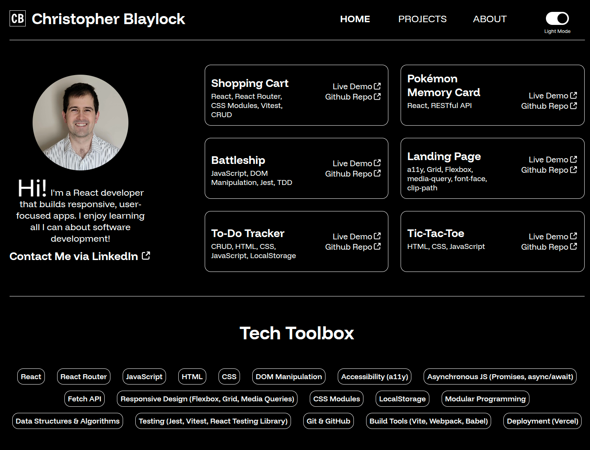

# Portfolio Site

A personal portfolio website built with React and React Router, designed to showcase my projects, skills, education, and work experience. The site features a dark mode toggle powered by the Context API, a custom image slider, and dynamic about cards that alternate image and text placement. Built with accessibility in mind and styled using CSS Modules, this site reflects my journey and passion for web development.

## Table of Contents

1. [Features](#features)
2. [Live Demo](#live-demo)
3. [Technologies Used](#technologies-used)
4. [Usage](#usage)
5. [Future Improvements](#future-improvements)
6. [Contributing](#contributing)
7. [License](#license)

## Features

-   **React & React Router:**  
    Dynamic routing and navigation using `NavLink` and `Link` for a smooth user experience.
-   **Dark Mode with Context API:**  
    Easily toggle between light and dark themes using a custom context. The website uses your preference if specified by your browser.
-   **Custom Image Slider on About Page:**  
    An interactive slider for displaying visual content.
-   **Dynamic About Cards:**  
    Alternating layout for about cards (left/right images) that highlight my personal experiences.
-   **Accessible Design:**  
    Built with accessibility best practices to ensure an inclusive experience.
-   **CSS Modules:**  
    Scoped, maintainable styles for a clean codebase.
-   **Standard Portfolio Sections:**  
    Includes a home page (bio, projects, tech toolbox, education, experience), a projects page (6 main projects), and an about page (personal hobbies and travels).

## Live Demo

**[View Live Demo](https://christopherblaylock.com/)**

## Technologies Used

**React, React Router, Context API, CSS Modules, JavaScript (ES6+), HTML5, CSS3**

## Usage

The site is organized into several key sections:

1. **Home Page:**  
   A short bio along with an overview of projects, technical skills, education, and work experience.
2. **Projects Page:**  
   Detailed display of my six main projects, complete with live demos and links to code repositories.
3. **About Page:**  
   Personal insights including hobbies, recent travels, and other experiences.
4. **Navigation:**  
   Seamless page transitions using React Router’s NavLink and Link components.
5. **Dark Mode Toggle:**  
   Instantly switch between light and dark themes for a personalized viewing experience.

## Future Improvements

-   **Responsive Design:**  
    Prioritize making the site fully responsive across all devices.
-   **CSS Animations:**  
    Add subtle animations for transitions and interactive elements.
-   **Dynamic Photo Loading:**  
    Optimize image loading for performance, especially on pages with many photos.
-   **API Integration:**  
    Explore integrating APIs for dynamic content updates.

## Contributing

Contributions, issues, and feature requests are welcome!

1. Fork the repository.
2. Create your feature branch: `git checkout -b feature/your-feature`
3. Commit your changes: `git commit -m 'Add a cool feature'`
4. Push to the branch: `git push origin feature/your-feature`
5. Open a Pull Request.

## License

This project is licensed under the [MIT License](./LICENSE.txt).
